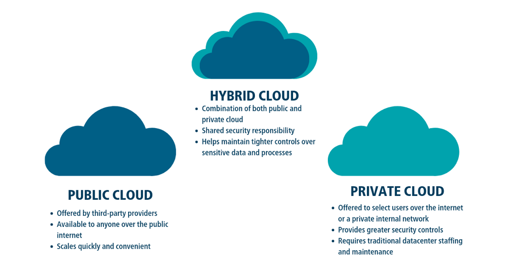
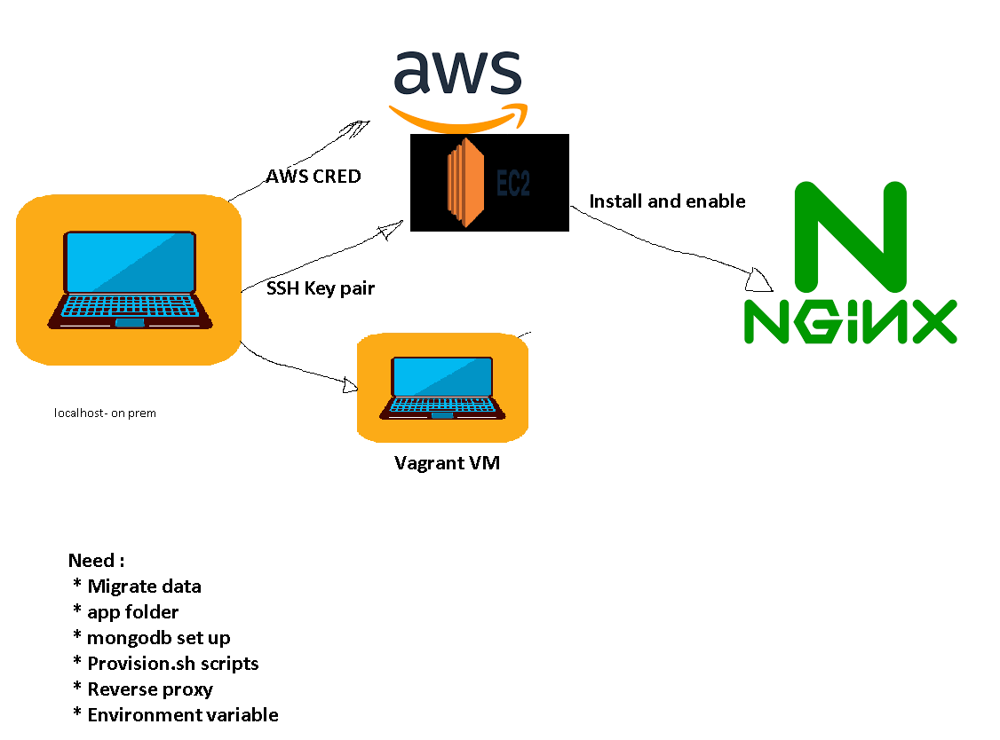

* Once logged in change password
* If AWS credentials are exposed, chain of command is informed and company gets fined.
* **Do not share password with anyone. Do not push credentials to github**
## Login process
1) Receive .csv file
2) Naming convention - DevOps_tech201
3) File has username, password and url
4) Go into url enter username and password
5) Once logged in change password and re-log
6) Change region from London to Ireland
7) Option can be found in the top right, next to name, select `Europe(Ireland) eu-west-1`
# What is AWS
* Amazon Web Services (AWS) is the world’s most comprehensive and broadly adopted cloud platform, offering over 200 fully featured services from data centers globally. Millions of customers—including the fastest-growing startups, largest enterprises, and leading government agencies—are using AWS to lower costs, become more agile, and innovate faster.
* Cloud computing is the delivery of computing services—including servers, storage, databases, networking, software, analytics, and intelligence—over the Internet (“the cloud”) to offer faster innovation, flexible resources, and economies of scale
## Benefits of AWS
* `Easy to use` - AWS is designed to allow application providers, ISVs, and vendors to quickly and securely host your applications – whether an existing application or a new SaaS-based application. You can use the AWS Management Console or well-documented web services APIs to access AWS’s application hosting platform.
* `Flexible` - AWS enables you to select the operating system, programming language, web application platform, database, and other services you need. With AWS, you receive a virtual environment that lets you load the software and services your application requires. This eases the migration process for existing applications while preserving options for building new solutions.
* `Cost-Effective1` - You pay only for the compute power, storage, and other resources you use, with no long-term contracts or up-front commitments. For more information on comparing the costs of other hosting alternatives with AWS, see the AWS Economics Center.
* `Reliable` - With AWS, you take advantage of a scalable, reliable, and secure global computing infrastructure, the virtual backbone of Amazon.com’s multi-billion dollar online business that has been honed for over a decade.
* `Scalable and high-performance` - Using AWS tools, Auto Scaling, and Elastic Load Balancing, your application can scale up or down based on demand. Backed by Amazon’s massive infrastructure, you have access to compute and storage resources when you need them.
* `Secure` - AWS utilizes an end-to-end approach to secure and harden our infrastructure, including physical, operational, and software measures. For more information, see the AWS Security Center.
## Types of cloud services- Infrastructure as a Service (IaaS)
* Provides acces to networking features, computers (virtual or dedicated hardware) and data storage space.
* Save money on hardware costs
* Rduce maintenance of on premise data centers -> delegate to larger firms with more security options.
* Bypass complexity of managing physical servers and datacenter infrastructure
### Advantages
* Security
* Reduced upfront cost
* Stability, reliability, supportability
* Helps scale up or down as needed- elastic
### Examples
* AWS
* Microsoft Azure
* Google cloud
* Digital Ocean
* Linode
## Platform as a Service (PaaS)
* Include the previous features of IaaS, and also: middleware (software that applications use to communicate with each other), development tools,business intelligence services, database management services, Os, runtime ( any library, framework or platform that code runs on e.g. built in functions)
### Advantages
* Cut coding time 
* Use sophisticated tools affordably
* Add development capabilities without extra staff
### Examples
* AWS elastic beanstalk (used for deploying and scaling web applications and services)
* Heroku
* Google App engine
## Software as a Service(SaaS)
* Connect to cloud based apps over the internet
* Provides complete software solutions which you rent
* Provider handles -> hardware, middleware, app software and app data
### Advantages
* Gain access to sophisticated applications
* Pay for what you use -> services scale up and down (elasticity)
* Use free client software -> most apps can be run through a browser without additional software downloads
* Access data form anywhere -> data is stored on the cloud which allows you to access from anywhere and any device
### Examples
* Microsoft teams
* Email
* Microsoft office services
* Netflix
## Capital expenditure vs Opertional expenditure
* `Capital expenditures` are a company's major, long-term expenses
* `Operating expenses` are a company's day-to-day expenses
* Cloud computing helps minimise `capital expenditures` , as services and can be scaled up/ down as needed.
* Previously, companies would have massive `capital expenditure` due to having to predict demand for their services far into the future, now they can respond to demand in near enough real time.
## Types of cloud



# Lesson
* Localhost = onprim
* Currently app and db are locally deployed
* If we were to provide this to a client, they would need to set up all the same machines as we did -> clients tend to be non technical
* Therefore want to make an environment thats globally available, cost effective, easy to manage etc.. -> migrate to cloud
* Most organisations are either migrating to cloud or they are already there, or they need someone to maintain the infrastructure, or create hybrid environments 
* Some orgs use on prim for security reasons
* Therefore best to learn on prim, then try to build a hybrid environment
* First - write a script -> understand what we are going to do before we do it
1) We have succesfully deployed our environments using provision scripting, but they are not globally available
2) To move to cloud, need AWS credentials
3) Need :
 * Migrate data
 * app folder
 * mongodb set up
 * Provision.sh scripts
 * Reverse proxy 
 * Environment variable
 ## 1
 * We deployed monolithic -> not scaleable
 * Every time there is a change, need to do vagrant up again -> system goes down while changes are implemented
 * Make it scaleable by refactoring monolith to 2tier architecture on the cloud
 * To refactor, we need to rent a machine on the cloud :
 * Buying pc considerations -> Storage, CPU, Memory, Screen size, Graphics system, SSD or hard drive , persistent storage or temporary memory etc.
 * Afterwards, need to secure because it is globally available -> anyone can attack from anywhere in the world
 * Need to create a firewall -security group on AWS
 * Cost -> after considering options, need to choose the most cost effective for our needs
 * Need to consider where they are accessing the site from -> e.g. client in New Zealand and our data center is in Ireland -> minimise request travel, reduce latency
 * We needed credentials to access our Vagrant VM -> SSH in local host did not require a key, it was secured by personal password
 * No personal password on cloud, need to make an SSH key, put it in a folder and send a request -> cant access without the key
 * Put the key  `tech201.pem` move to .ssh folder in your localhost
 * `cd + ENTER` brings you home
 * The key must match the lock
 * SSH keypair -> if the key we provide matches the lock, we can log in
 * AWS credentials -> AWS key
 ## Make key
 1) Log in to AWS
 2) Search `ec2` and click on it
 3) Click keypair
 4) Generate and download the key
 5) Move the key file to `.ssh` folder
 6) Click `EC` Dashboard
 7) Click `launch instance`
 * Naming convention -> `name-groupname-what you are launching (app in this case)`
 8) Select `ubuntu 18.04` as OS
 * Now edit the network settings
 9) Select CPU - `t2.micro` is fine for now 
 10) Enter the key file name -> e.g. `devops-tech201`
 11) Keep the default `vpc setting`
 12) For subnet, select -> `DevOpsStudent default 1a`
 13) Auto assign IP -> `Enable`
 14) Firewall security ->`Create security group`
 15) Security group name -> `BENAS-TECH201-APP-REQUIRED PORTS 3000-80-` (can name this anything)
 16) Add a security group rule:
 17) Type -> `Custom TCP`
 18) Port Range -> `3000`
 19) Description optional -> `For node app` (description is optional)
 20) Source type -> `Anywhere`
 * Should also have
 * After setup, machine EC2 should be running in the cloud
 * When machine is launched, it is initialied and
 * Now want to test the machine
 * First, need to `SSH` into the machine by sending a request
 * Click `connect` and select `SSH client`
 * SSH client = gitbash terminal
 * step 3 makes it readable
 * Run `gitbash` as admin and `cd` into the `.ssh` folder, and copy step 3 command to check permissions
 * Copy the example command into the terminal to `ssh` into the virtual environment 
 * When the command is entered, request goes to AWS and if everything is configured correctly we should be connected
 * Once inside, `update` and `upgrade` your system:
 * `sudo apt-get update -y`
 * `sudo apt-get upgrade -y`
 * Then install and enable `nginx`:
 * `sudo apt-get install nginx`
 * `sudo systemclt enable nginx`
 * Should now be able to use the `public IPv4 address` to connect to nginx webpage on your browser



## Possible errors
### Connection has times out/ access denied
* Caused when port 22 is not open or the IP is wrong
* Navigate to `security` in your instance and select the blue string under `security groups`
* Click `edit inbound rules`
* For port `22`, set the source to `My IP` and `save rules`

* Key not found - permission denied
## AWS console tour
* Static IP-> doesn't change
* Dynamic IP -> changes
* If your IP is dynamic, may need to go into security group and tell AWS to allow your new IP
* How to secure app -> with AWS credentials, AWS keypair, 
* System reachability ->
* Basic monitoring is enabled by default in AWS
## Data migration
* Now want to take the app data available locally and transfer it to the EC2 instance
* Migrate app folder with provision.sh
* Migrate reverse proxy configuration
* Install required dependencies
* Can use rsynch command or ssh to send data from 1 end point to the other
* Sending request from local host to global it gets verifeid with .pem file, therefore need to include .pem file in command
## Transferring a directory from a local machine to ec2
* Open `gitbash` as an administrator
* Navigate to the `.ssh` folder
* Inside the folder, run the following command : `scp -i devops-tech201.pem -r <your directory path> ubuntu@<your IP in the example block you paste to ssh into ec2>:/home/ubuntu`
* This will copy your `directory` folder into the `home` directory in the ec2 VE
* In this example, the `provisioning` and `reverse_proxy` files were also in the `app` directory which we transferred
* If this was not the case and we still wanted to import those files, you would need to run the same command for each file, except without the `-r` flag
* Once the directory/files are transferred , `ssh` into `ec2` using the instructions from `AWS`
* Inside the `VE`, navigate to the `app` directory and run your provision script.
* For this example, this would be:
```
sh provsion.sh
```
* Run the app with:
```
node app.js
```
* You should now be able to connect to your `app` wihtout a port number using the ipv4 public IP address on AWS.
