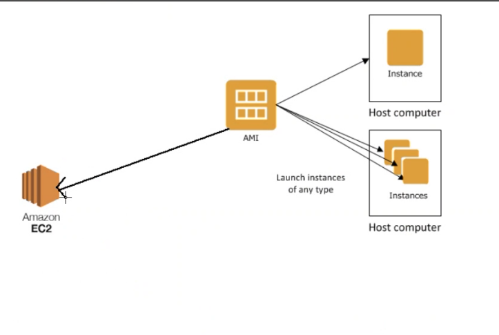

* Once logged in change password
* If AWS credentials are exposed, chain of command is informed and company gets fined.
* **Do not share password with anyone. Do not push credentials to github**
## Login process
1) Receive .csv file
2) Naming convention - DevOps_tech201
3) File has username, password and url
4) Go into url enter username and password
5) Once logged in change password and re-log
6) Change region from London to Ireland
7) Option can be found in the top right, next to name, select `Europe(Ireland) eu-west-1`
# What is AWS
* Amazon Web Services (AWS) is the world’s most comprehensive and broadly adopted cloud platform, offering over 200 fully featured services from data centers globally. Millions of customers—including the fastest-growing startups, largest enterprises, and leading government agencies—are using AWS to lower costs, become more agile, and innovate faster.
* Cloud computing is the delivery of computing services—including servers, storage, databases, networking, software, analytics, and intelligence—over the Internet (“the cloud”) to offer faster innovation, flexible resources, and economies of scale
## Benefits of AWS
* `Easy to use` - AWS is designed to allow application providers, ISVs, and vendors to quickly and securely host your applications – whether an existing application or a new SaaS-based application. You can use the AWS Management Console or well-documented web services APIs to access AWS’s application hosting platform.
* `Flexible` - AWS enables you to select the operating system, programming language, web application platform, database, and other services you need. With AWS, you receive a virtual environment that lets you load the software and services your application requires. This eases the migration process for existing applications while preserving options for building new solutions.
* `Cost-Effective1` - You pay only for the compute power, storage, and other resources you use, with no long-term contracts or up-front commitments. For more information on comparing the costs of other hosting alternatives with AWS, see the AWS Economics Center.
* `Reliable` - With AWS, you take advantage of a scalable, reliable, and secure global computing infrastructure, the virtual backbone of Amazon.com’s multi-billion dollar online business that has been honed for over a decade.
* `Scalable and high-performance` - Using AWS tools, Auto Scaling, and Elastic Load Balancing, your application can scale up or down based on demand. Backed by Amazon’s massive infrastructure, you have access to compute and storage resources when you need them.
* `Secure` - AWS utilizes an end-to-end approach to secure and harden our infrastructure, including physical, operational, and software measures. For more information, see the AWS Security Center.
## Types of cloud services- Infrastructure as a Service (IaaS)
* Provides acces to networking features, computers (virtual or dedicated hardware) and data storage space.
* Save money on hardware costs
* Rduce maintenance of on premise data centers -> delegate to larger firms with more security options.
* Bypass complexity of managing physical servers and datacenter infrastructure
### Advantages
* Security
* Reduced upfront cost
* Stability, reliability, supportability
* Helps scale up or down as needed- elastic
### Examples
* AWS
* Microsoft Azure
* Google cloud
* Digital Ocean
* Linode
## Platform as a Service (PaaS)
* Include the previous features of IaaS, and also: middleware (software that applications use to communicate with each other), development tools,business intelligence services, database management services, Os, runtime ( any library, framework or platform that code runs on e.g. built in functions)
### Advantages
* Cut coding time 
* Use sophisticated tools affordably
* Add development capabilities without extra staff
### Examples
* AWS elastic beanstalk (used for deploying and scaling web applications and services)
* Heroku
* Google App engine
## Software as a Service(SaaS)
* Connect to cloud based apps over the internet
* Provides complete software solutions which you rent
* Provider handles -> hardware, middleware, app software and app data
### Advantages
* Gain access to sophisticated applications
* Pay for what you use -> services scale up and down (elasticity)
* Use free client software -> most apps can be run through a browser without additional software downloads
* Access data form anywhere -> data is stored on the cloud which allows you to access from anywhere and any device
### Examples
* Microsoft teams
* Email
* Microsoft office services
* Netflix
## Capital expenditure vs Opertional expenditure
* `Capital expenditures` are a company's major, long-term expenses
* `Operating expenses` are a company's day-to-day expenses
* Cloud computing helps minimise `capital expenditures` , as services and can be scaled up/ down as needed.
* Previously, companies would have massive `capital expenditure` due to having to predict demand for their services far into the future, now they can respond to demand in near enough real time.
## Types of cloud


# Lesson
* Localhost = onprim
* Currently app and db are locally deployed
* If we were to provide this to a client, they would need to set up all the same machines as we did -> clients tend to be non technical
* Therefore want to make an environment thats globally available, cost effective, easy to manage etc.. -> migrate to cloud
* Most organisations are either migrating to cloud or they are already there, or they need someone to maintain the infrastructure, or create hybrid environments 
* Some orgs use on prim for security reasons
* Therefore best to learn on prim, then try to build a hybrid environment
* First - write a script -> understand what we are going to do before we do it
1) We have succesfully deployed our environments using provision scripting, but they are not globally available
2) To move to cloud, need AWS credentials
3) Need :
 * Migrate data
 * app folder
 * mongodb set up
 * Provision.sh scripts
 * Reverse proxy 
 * Environment variable
 ## 1
 * We deployed monolithic -> not scaleable
 * Every time there is a change, need to do vagrant up again -> system goes down while changes are implemented
 * Make it scaleable by refactoring monolith to 2tier architecture on the cloud
 * To refactor, we need to rent a machine on the cloud :
 * Buying pc considerations -> Storage, CPU, Memory, Screen size, Graphics system, SSD or hard drive , persistent storage or temporary memory etc.
 * Afterwards, need to secure because it is globally available -> anyone can attack from anywhere in the world
 * Need to create a firewall -security group on AWS
 * Cost -> after considering options, need to choose the most cost effective for our needs
 * Need to consider where they are accessing the site from -> e.g. client in New Zealand and our data center is in Ireland -> minimise request travel, reduce latency
 * We needed credentials to access our Vagrant VM -> SSH in local host did not require a key, it was secured by personal password
 * No personal password on cloud, need to make an SSH key, put it in a folder and send a request -> cant access without the key
 * Put the key  `tech201.pem` move to .ssh folder in your localhost
 * `cd + ENTER` brings you home
 * The key must match the lock
 * SSH keypair -> if the key we provide matches the lock, we can log in
 * AWS credentials -> AWS key
 ## Make key
 1) Log in to AWS
 2) Search `ec2` and click on it
 3) Click keypair
 4) Generate and download the key
 5) Move the key file to `.ssh` folder
 6) Click `EC` Dashboard
 7) Click `launch instance`
 * Naming convention -> `name-groupname-what you are launching (app in this case)`
 8) Select `ubuntu 18.04` as OS
 * Now edit the network settings
 9) Select CPU - `t2.micro` is fine for now 
 10) Enter the key file name -> e.g. `devops-tech201`
 11) Keep the default `vpc setting`
 12) For subnet, select -> `DevOpsStudent default 1a`
 13) Auto assign IP -> `Enable`
 14) Firewall security ->`Create security group`
 15) Security group name -> `BENAS-TECH201-APP-REQUIRED PORTS 3000-80-` (can name this anything)
 16) Add a security group rule:
 17) Type -> `Custom TCP`
 18) Port Range -> `3000`
 19) Description optional -> `For node app` (description is optional)
 20) Source type -> `Anywhere`
 * Should also have
 * After setup, machine EC2 should be running in the cloud
 * When machine is launched, it is initialied and
 * Now want to test the machine
 * First, need to `SSH` into the machine by sending a request
 * Click `connect` and select `SSH client`
 * SSH client = gitbash terminal
 * step 3 makes it readable
 * Run `gitbash` as admin and `cd` into the `.ssh` folder, and copy step 3 command to check permissions
 * Copy the example command into the terminal to `ssh` into the virtual environment 
 * When the command is entered, request goes to AWS and if everything is configured correctly we should be connected
 * Once inside, `update` and `upgrade` your system:
 * `sudo apt-get update -y`
 * `sudo apt-get upgrade -y`
 * Then install and enable `nginx`:
 * `sudo apt-get install nginx`
 * `sudo systemclt enable nginx`
 * Should now be able to use the `public IPv4 address` to connect to nginx webpage on your browser


## Possible errors
### Connection has times out/ access denied
* Caused when port 22 is not open or the IP is wrong
* Navigate to `security` in your instance and select the blue string under `security groups`
* Click `edit inbound rules`
* For port `22`, set the source to `My IP` and `save rules`

* Key not found - permission denied
## AWS console tour
* Static IP-> doesn't change
* Dynamic IP -> changes
* If your IP is dynamic, may need to go into security group and tell AWS to allow your new IP
* How to secure app -> with AWS credentials, AWS keypair, 
* System reachability ->
* Basic monitoring is enabled by default in AWS
## Data migration
* Now want to take the app data available locally and transfer it to the EC2 instance
* Migrate app folder with provision.sh
* Migrate reverse proxy configuration
* Install required dependencies
* Can use rsynch command or ssh to send data from 1 end point to the other
* Sending request from local host to global it gets verifeid with .pem file, therefore need to include .pem file in command
## Transferring a directory from a local machine to ec2
* Open `gitbash` as an administrator
* Navigate to the `.ssh` folder
* Inside the folder, run the following command : `scp -i file.pem -r <your directory path> ubuntu@<your IP in the example block you paste to ssh into ec2>:/home/ubuntu`
* This will copy your `directory` folder into the `home` directory in the ec2 VE
* In this example, the `provisioning` and `reverse_proxy` files were also in the `app` directory which we transferred
* If this was not the case and we still wanted to import those files, you would need to run the same command for each file, except without the `-r` flag
* Once the directory/files are transferred , `ssh` into `ec2` using the instructions from `AWS`
* Inside the `VE`, navigate to the `app` directory and run your provision script.
* For this example, this would be:
```
sh provsion.sh
```
* Run the app with:
```
node app.js
```
* You should now be able to connect to your `app` wihtout a port number using the ipv4 public IP address on AWS.

- cap
## Using git
* You can clone your whole repository which contains the desired files by simply entering the VE using `ssh` and running the command
## SSH key pair
* Want a secure connection betwenn endpoint A and B
* Could be local host and AWS etc..
* Send a request betweene endpoints asks if we would like to copy key into hosts localfile-> if key matches it copeys key into other endpoint
* Next time you send request key already matches, so you log in faster
## Choosing a region to deploy in
* In practical situations, region must be closest to user/ client
* Each region has different data centers/availabily zones(AZ's, minimum 2)
* Ireland has 3 AZ's -> euw1a, b ,c
* Different regions and AZ's have different services available
* Therefore need to choose region and AZ with the services we require, even if its not the closest
* E.g. clinet wants lambda functions or wanto be serverless, but the nearest data centre does not have it
* When choosing a region or AZ, need to consider latency as well as client requirements
## 2 Tier architecture
* We use Ireland because we are all UK based and it has 3 AZ's
* When we launch `auto scaler group` and `load balancer` we will want to launch in multiple AZ's so we can balance the traffic and make it highly available
* `VPC` virtual private cloud -> provides range of postcodes to use
* From local host we entered AWS VPC using internet gateway
* From there launched instance in a public subnet (DevOps student 1a) to insure that the subnet is visible globally and anyone can access public IP -> this is monolithic
* Migrated data and installed dependencies, app running
* Now need to launch another server in a independent subnet with the database
* Want to make sure that the user does not have access to the database subnet
* If database goes down, its an independent event, doesnt affect app subnet functionality -> can have an if check in app -> if status != 200, redirect to page saying database service is down
* Not possible with monolith, is `vagrant up` doesn't work, everything is down
* Need to refactor because monolith is not scaleable
* Refactoring also allows for agile methodology and scrum framework -> small teams working independently on different subnets
* Scaleable -> want another feature, can connect to another subnet via a gateway, develop that subnet independetly without affecting the user journey, since all other features fucntion indepenmdently.
* Development and maintenance should not affect user journey -> down time is lost profit
* Test it, if it works add another path so the user gets redirected to the subnet with the required service


### How does a 2 tier architecture fit into DevOps?
* Flexibility - 


## Requirements
* App tier deployed -> available on public IP
* Create 2nd tier with required dependencies: Ubuntu 18.04,
mongodob installed, change mongod.conf 0.0.0.0.
* Need a security group for our database - allow 27017 from anywhere - allow only from app instance
* Go back to the app and create an environment variable with the database endpoint
* Relaunch the app
* Securing architecture with firewalls
* Separate firewall to app, seperate firewall to database
* App is exposed to the world, database is exposed only to app, limiting access to database
* DB should not have a public IP
* In production, security group access IP needs to be private and it should be the app IP
* Make a file executable -> sudo chmod +x file.sh
* Can type `history` to see command history

## Creating the database environment
1) On AWS, enter `EC2` and click launch instance
2) Name your instance in the appropriate format e.g: name-org-what is being launched
3) Select your OS, in this example it is Ubuntu 18.04
4) Select the instance type, t2.micro is suitable for now
5) Enter the same key that you used for you `app` VE
6) Keep the network default
7) Choose the same subnet as you did for you `app` for simplicity
* **Note- In a real production environment you would not want to auto-enable a public IP for a database, since users should not be able to access it, but for learning/testing purposes it can be left on**
8) Create a security group
9) Edit security group
10) Create a `Custom TCP` with a port range matching your `database port`
11) The default storage configuration settings are fine -> launch the instance
12) Enter the instance management screen and select your newly created instance
13) Click connect
14) Select `ssh client`
15) Open a gitbash terminal as an administrator and `cd` to the `.ssh` folder
16) Set permissions by copying the 3rd command on the ssh page and running it in your terminal
17) SSH into the VE by copying the example code at the bottom of the SSh window and running it in you terminal
18) Inside the database VE, run git clone `<https:your repository with the database derictory and required provisioning files>`
19) `cd` into the cloned repository, and execute your provision script, there are 2 ways to do this :
* Make the file executable: `sudo chmod +x file.sh`
* Now run the file : `sudo ./file.sh`
* Or you can run `sh file.sh`
20) Double check that the mongodb database is running with :`sudo systemctl status mongod`
21) Double check that the configuration file has been correctly changed by your script: `cat /etc/mongod.conf`
* The `database` VE is now made and configured, but it is not linked to our `app` VE


### Potential issues
* `Mongodb not running when checking the status` - Examine the error message taht you get. In most instances this will be due to your script not replacing the `.conf` file correctly. To fix this, completely uninstall mongodb and all its attachtments and reinstall it manually from scratch. The command `rm -rf mongod` can be used to remove mongodb, and any extensions which remain. To remove the extensions, simply do the same command, but copy the mongod.extension that you see when your VE tells you what mongod dependencies still remain
* `.conf file isn't configured` - If this is the case, run the command: `sudo nano /etc/mongod.conf` and change the IP manually. Save your changes by doing: `CTRL + x`, then `y`, then `ENTER`. Afterwards, take some time to re-examine and refactor your script so that it automates this step for you
* `Error [MongoError]: failed to connect to server [192.168.10.150:27017] on first connect [Error [MongoError]: connection 0 to 192.168.10.150:27017 timed out` - Your app is looking for the database but it cant find it using with the provided IP. To fix this, either launch your `database` and connect you environment variable using the correct IP. Alternatively, delete the environmental variable by setting the value to nothing. For example, `DB_HOST=`
* ` root is in ssh login command` - Simply replace `root` with `ubuntu`. AWS presumes you have admin powers, therefore attaches root by default.
## Connect the `app` VE to `database` VE
1) Launch your `app` ec2 instance
2) Click connect
3) Click `ssh client`
4) Open another gitbash terminal as an administrator and `cd` to the `.ssh` folder
5) Copy the example code found on the `ssh client` page and run it in the `.ssh` folder 
6) Make an environmental variable to connect the app VE to the database VE:
```
export DB_HOST=http//dbip:port
```
7) Seed the database in the app folder:
```
node seeds/seed.sj
```
## AMI (amazon machine image)
* Images allow us to stop an ec3 instance and to restart it from the exact same state
* 2 machines in a stopped state with different dependencies, they still cost money
* Amazon machine image takes a snapshot of an ec2 instance -> saves the state of the instance , including dependencies
* Image is available in the same region as the instance
* Images help save the business money, as they are much cheaper to maintain then even a stopped instance
* After confirming that your image is running, you can `terminate` your instance
* Images save you time, as you dont have to remake your instance from scratch, all the neccessary dependencies are saved within the image 
## Creating an image
1) `SSH` into your `app` virtual machine
2) Navigate to the directory with `app.js` and launch the app:
```
node app.js
```
* The `app` must be launched because you want to make an image of your machine in a running state, because thats how it will be saved
3) Select the `app` instance on `AWS` and from the `actions` drop down menu, select `image and templates` -> `Create image`
4) Specify the `image` name following your naming convention, e.g. `name-group-ve-ami`
5) In the description, use the same naming convention but also add what ports can connect to the instance, so thath when you come back to the image further down the line you know how to use it, e.g : `name-group-ve-ami-port1-port2-port3-etc`
6) Create the instance
7) To find your instance from the AWS home page, search `EC2` and click on it
8) On the left hand side, under `Images`, click `AMIs`
9) Find your image by typing in your instance name
10) Select the image and click `Launch instance from AMI`
11) Name the instance appropriately : `name-group-db-ami`
12) Enter your key
13) Select an existing security group, and choose your old db security group from the list
* This step is why it is useful to name your `security groups`, as know you know what ports can be used
14) Launch the instance
15) From here, your instance should be initiated, with the same dependencies as when the image was created
16) To relaunch your 2 tier architecture, simply update the environmental variable in your `app` ve to have the ip of the new `db`, and from there the steps are the same:
17) Seed the database in the app directory:
```
node seeds/seed.js
```
18) Launch the app
```
node app.js
```


## Why use AMIs?
* Images save the business money, as they are cheaper to maintain than even stopped instances
* They help speed up development, as all of your dependencies are stored inside the image, so that when you use the image to launch an instance that instance comes pre-installed with all of the previous dependencies
* They help minimise the chance of error, as you do not need to manually reconfigure the instance from scratch, you only need to select the security group you would like to use, the rest of the options are saved.
