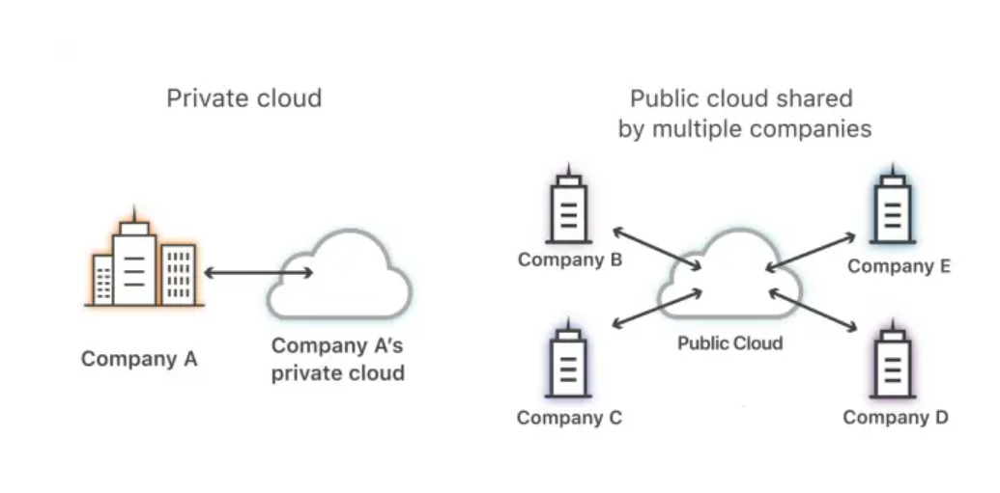
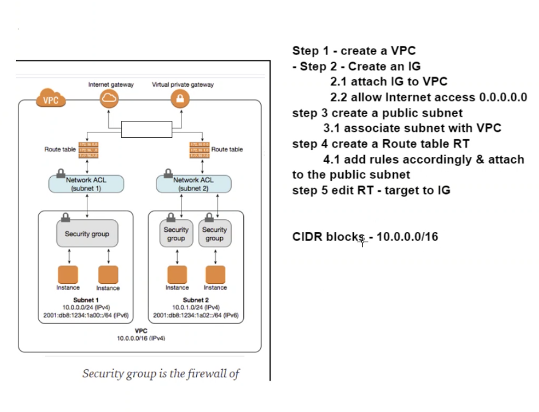

## Virtual Private Cloud-VPC 
* A virtual private cloud (VPC) is a private cloud computing model which is contained within a public cloud
* A VPC similarly reserves some of the public cloud’s resources for use by just one customer
* A VPC sets aside logically isolated parts of a public cloud to create a virtual private environment.
* Processing and data storage systems are not intermingled with other tenants. This is achieved by using physical and virtual mechanisms managed by a cloud computing vendor. 
* VPC clients can run code, store data, host websites and do all the things they can do in a private cloud. 
* Users get a unique private IP subnet they can use as if the hardware and software are on-premises. 
* VPCs use a secure virtual communications network which may or may not have a dedicated circuit to the cloud provider.
* Like all cloud environments, virtual private cloud resources are available on-demand



## Difference between private cloud and virtual private cloud
*  A private cloud is single-tenant – a service exclusively offered to one organisation. A virtual private cloud is a private cloud within a public cloud
* A private cloud runs on dedicated infrastructure which may reside on-premises in a dedicated off-premises data centre – or within a managed cloud vendor. Advantages of a private cloud include control and exclusivity. There are no neighbours to share hosted resources with
* In a traditional on-premises private cloud model, the enterprise’s in-house IT team acts as a service provider, with the individual business units acting as tenants
* With a private cloud, users need to make a significant investment in hardware and software – and space still needs to be rented or bought from cloud service providers. Private clouds also require any number of people to manage them. This makes private clouds relatively expensive to run – and top-level security isn’t guaranteed either
* However, in a VPC model, a public cloud provider takes on the role of the service provider, while the subscribers to the cloud are the tenants. Organisations benefiting most from a VPC are enterprises that require a private cloud environment that’s both secure, yet allows users to retain control
## How does a VPC work
* VPCs function like a private cloud that runs on public or shared architecture
* Encryption. VPNs (virtual private networks) use encryption to create a private network above the public network. VPN traffic passes through an internet infrastructure that comprises routers and switches etc. that are publicly accessible. The traffic, however, is scrambled and therefore invisible to other users. 
* Private IP addresses (subnets). A subnet is a range of IP addresses in a network reserved for a certain user. These private IPs are not accessible via the public internet, unlike usual IP addresses. 
* Allocating a unique virtual local area network (VLAN) to each customer. A VLAN is a group of computing devices connected to each other without the use of the internet. A VLAN is a virtual LAN. Like a subnet, a VLAN can partition a network – but this partitioning occurs at a different layer within the Open Systems Interconnection Model (OSI) – at layer two instead of three. 
* A virtual private cloud user can usually create and manage their own network components including IP addresses, network gateways, access control parameters and subnets
### Advantages of VPC
* `Agility` - A VPC gives users full control over the network size along with automation to scale resources up or down whenever required. These resources can be scaled dynamically in real-time.
* `Security` - Even though the VPC is part of the public cloud, it is logically isolated so a user’s data and space don’t mix with a cloud provider’s other customers. Users have full control of how resources and workloads are accessed and by whom. The public cloud providers offering VPCs have more resources than small to medium-sized businesses for updating and maintaining cloud infrastructures. These include the use of firewalls – e.g. the firewall capabilities on AW that addresses specific security needs. Logical isolation makes the VPC environment more secure, but only if public cloud security is intentionally deployed. Responsibility for cloud security is shared between the cloud provider and the user and users must take steps to secure their data and apps in the cloud. For example, public cloud environments like Amazon AWS can be secured with third-party apps that are able to detect and manage threats like DDoS attacks automatically. 
* `Hybrid clouds are easy to deploy` - It’s relatively easy to connect a VPC to a public cloud – or to on-premises cloud architecture via a VPN. 
* `Improved performance` - Cloud-hosted websites and apps generally perform better than those hosted on on-premises servers.VPCs enable a hybrid cloud environment where an organisation can use a VPC as an extension of their own data centre, without having to deal with the complexity of building an on-premises private cloud. 
* `Availability` - Redundant resources and architectures that are highly fault-tolerant mean that pass and workloads are highly available which means VPC environments can provide close to 100% uptime expectations. 
* `Satisfied customers` - Today’s ‘always on’ digital business environment means that customers demand uptime ratios of up to 100%. The high availability of VPC models supports reliable online interactions and experiences that build customer trust and loyalty. 
* `Increased resources to channel innovation` - With reduced costs and fewer demands on the IT team, enterprises can focus on achieving their key business objectives. 
## Subnets
* A range of IP addresses in your VPC
* A subnet, or subnetwork, is a network inside a network. Subnets make networks more efficient. Through subnetting, network traffic can travel a shorter distance without passing through unnecessary routers to reach its destination.
* When a network receives data packets from another network, it will sort and route those packets by subnet so that the packets do not take an inefficient route to their destination.
## Public subnet
* A public subnet is a subnet that is associated with a route table that has a route to an Internet gateway. This connects the VPC to the Internet and to other AWS services.
* The resources in the public subnet can send outbound traffic directly to the Internet and vice versa. For example web server needs to be accessed by users from the internet.
## Private subnet
* A private subnet is a subnet that is associated with a route table that doesn’t have a route to an internet gateway. Instances in the private subnet are backend servers they don’t accept the traffic from the internet.
* Resources like database may require connection to internet for updates/patches but should not be accepting request from the internet. In such cases a private subnet is to be used.


## Route table
* A set of rules, called routes, that are used to determine where network traffic is directed.
## Internet gateway
*  A gateway that you attach to your VPC to enable communication between resources in your VPC and the internet.
## CIDR blocks
* Classless Inter-Domain Routing (CIDR) notation is a way of representing an IP address and its network mask. The format of these addresses is as follows:
* An individual IPv4 address is 32 bits, with 4 groups of up to 3 decimal digits. For example, 10.0.1.0.
* An IPv4 CIDR block has four groups of up to three decimal digits, 0-255, separated by periods, followed by a slash and a number from 0 to 32. For example, 10.0.0.0/16.
* An individual IPv6 address is 128 bits, with 8 groups of 4 hexadecimal digits. For example, 2001:0db8:85a3:0000:0000:8a2e:0370:7334.
* An IPv6 CIDR block has four groups of up to four hexadecimal digits, separated by colons, followed by a double colon, followed by a slash and a number from 1 to 128. For example, 2001:db8:1234:1a00::/56.
### More on CIDR blocks
* When you create a VPC, you assign it an IPv4 CIDR block (a range of private IPv4 addresses), an IPv6 CIDR block, or both IPv4 and IPv6 CIDR blocks (dual-stack).
* Private IPv4 addresses are not reachable over the internet. IPv6 addresses are globally unique and can be configured to remain private or be reachable over the internet.
* Your VPC can operate in dual-stack mode. This means that your resources can communicate over IPv4, IPv6, or both IPv4 and IPv6. IPv4 and IPv6 addresses are independent of each other; you must add separate routes and security group rules for IPv4 and IPv6
## Why amazon wanted VPC
* Public network -> no security, anyone can access it, you simply rent a space in a public area
* AWS introduced gov cloud for government organisations
* Then introduced VPC -> can rent your own space on the cloud that only you have access, can do whatever in that space
* NACL -> works on a subnet level whereas security groups work on an instance level
## VPC
* VPC has a CIDR block which is the ip for the VPC
* Internet gateway allows vpc to interact with the internet
* Virtual private gateway 
* Step 1 - Create a VPC
* Step 2 - Create an internet gateway
* Step 3 - Attach internet gatewat to VPC
* Step 4 - Allow internet access 0.0.0.0.0
* Step 5 - Create a public subnet
* Step 6 - Associate subnet with VPC
* Step 7 - Create a route table
* Step 8 - Add rules accordingly and attach to the public subnet
* Step 9 - Edit route table -> target to internet geteway
* CIDR block - 10.0.0.0/16 for the vpc
* CIDR block - 10.0.0.0/24 for the subnet



## Building a 2 tier architecture on a custom VPC and custom subnets - `Making the VPC`
1) On the AWS homepage, search `VPC` and click on the `VPC` option
2) Click Create VPC
3) Choose `VPC only`
3) Name the VPC with an accepted format e.g: `name-group-vpc`
4) Choose `IPv4 CIDR manual input`
5) For the IPv4 CIDR block, enter the following : ` 10.0.0.0/16`
6) Click `Create VPC`
## Building a 2 tier architecture on a custom VPC and custom subnets - `Making the public subnet`
1) On the AWS homepage, search `VPC` and click on the `VPC` option
2) On the left hand side, click `Subnets`
3) Click `Create subnet`
4) Select your vpc 
5) Name you subnet ,e.g: `name-group-public-app`
6) Enter a valid IPv4 CIDR block. This can be found out by using an online CIDR calculator and entering your VPC IP, e.g. 10.0.0.0/16. This will output a range of all valid IPs. If an IP that you selected is taken, try another one from the range.
7) Click `Create subnet`
## Building a 2 tier architecture on a custom VPC and custom subnets - `Creating an internet gateway`
1) On the AWS homepage, search `VPC` and click on the `VPC` option
2) On the left hand side, click `Internet gateways`
3) Click `Create internet gateway`
4) Name your gateway, e.g: `name-group-IG`
5) Click `Create internet gateway`
6) Select your created internet gateway
7) From the `Actions` drop down menu, select `Attach to VPC`
8) Select your VPC
9) Attach the internet gateway
## Building a 2 tier architecture on a custom VPC and custom subnets - `Creating a route table for the public subnet`
1) On the AWS homepage, search `VPC` and click on the `VPC` option
2) On the left hand side, click `Route tables`
3) Click `Create route table`
4) Name your route table : `name-group-rt`
5) Click `Create route table`
6) Select your route table from the list
7) Click `Subnet associations` -> `Edit subnet associations`
8) Select your `public subnet`
9) Click `Save associations`
10) Click `Routes` -> `Edit routes`
11) Click `Add route`
12) In the left most box, enter: `0.0.0.0/0`
13) In the right box, select `Internet Gateway` from the drop down list
14) Select your internet gateway
15) Click `Save changes`
## Building a 2 tier architecture on a custom VPC and custom subnets - `Making the private subnet`
1) On the AWS homepage, search `VPC` and click on the `VPC` option
2) On the left hand side, click `Subnets`
3) Click `Create subnet`
4) Select your vpc 
5) Name you subnet ,e.g: `name-group-private-db`
6) Enter a valid IPv4 CIDR block. This can be found out by using an online CIDR calculator and entering your VPC IP, e.g. 10.0.0.0/16. This will output a range of all valid IPs. If an IP that you selected is taken, try another one from the range.
7) Click `Create subnet`
## Building a 2 tier architecture on a custom VPC and custom subnets - `Creating a route table for the private subnet`
1) On the AWS homepage, search `VPC` and click on the `VPC` option
2) On the left hand side, click `Route tables`
3) Click `Create route table`
4) Name your route table : `name-group-rt`
5) Click `Create route table`
6) Select your route table from the list
7) Click `Subnet associations` -> `Edit subnet associations`
8) Select your `private subnet`
9) Click `Save associations`
## Building a 2 tier architecture on a custom VPC and custom subnets - ` Launching the database instance`
1) Navigate to `EC2`
2) Click `Launch instance`
3) Name your instance, e.g: `name-group-db-vpc`
4) Select the `ami` which has all the dependencies that your database needs
5) For instance type select: `t2.micro`
6) Enter your `key`
7) Click `Edit` network settings
8) Select your vpc
9) Select your `private` subnet
10) `Disable` Auto-assign public IP
11) Create a security group with the following ports:
* Port 22 from your IP
* Port 27017 from anywhere
* Your app CIDR block
12) Name the security group accordingly, by adding the used ports in the name
13) Click `Launch instance`
## Building a 2 tier architecture on a custom VPC and custom subnets - ` Launching the app instance`
1) Navigate to `EC2`
2) Click `Launch instance`
3) Name your instance, e.g: `name-group-app-vpc`
4) Select the `ami` which has all the dependencies that your app needs
5) For instance type select: `t2.micro`
6) Enter your `key`
7) Click `Edit` network settings
8) Select your vpc
9) Select your `public` subnet
10) `Enable` Auto-assign public IP
11) Create a security group with the following ports:
* Port 22 from your IP
* Port 3000 from anywhere
* HTTP port 80 from anywhere
12) Name the security group accordingly, by adding the used ports in the name
13) Click `Launch instance`
## Building a 2 tier architecture on a custom VPC and custom subnets - `Connecting the instances`
1) `SSH` into your app instance
2) Update your environmental variable to have the IP of your database
```
export DB_HOST=mongodb://<db_IP>:27017/posts
```
3) Navigate to the directory which has your `app.js` file
4) Seed your database:
```
node seeds/seed.js
```
5) Launch your app
```
node app.js
```